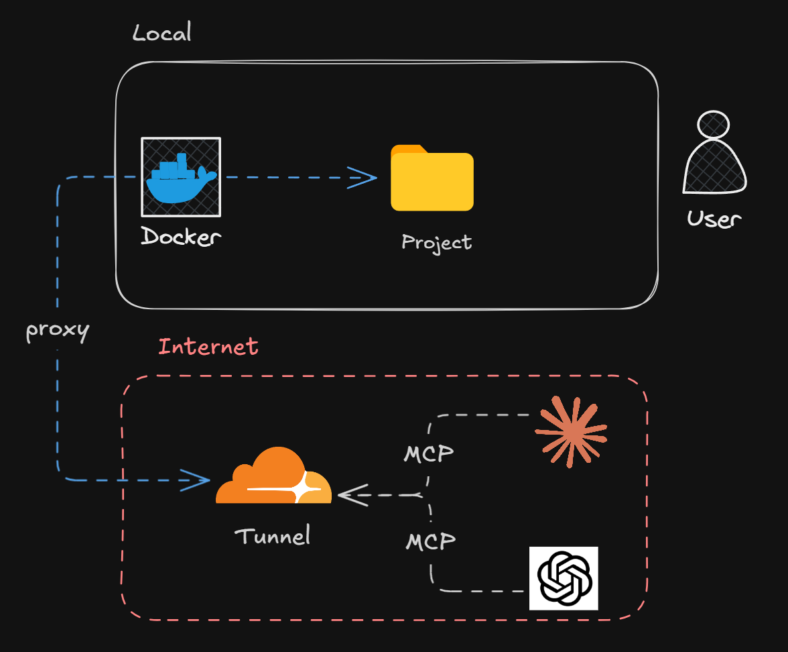
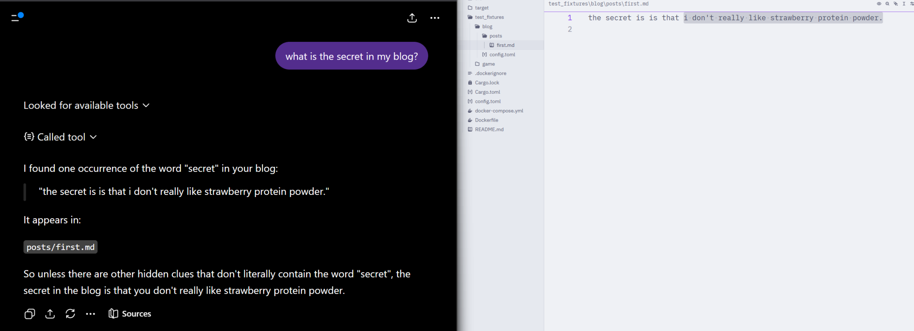

# PastaMCP

give chatbots context about your project.




## dependenices
- cloudflared
- docker
## getting started
start mcp server and tunnel
```bash
cloudflared tunnel --url http://localhost:6967
docker-compose up --build
```
give public url to your choosen chatbot such as chatgpt.com or gemini.google.com.

## tools

| Tool | Description | Example |
|------|-------------|---------|
| `list_projects` | List all available project keys | **Call:** `list_projects()`<br>**Result:** `{ "projects": ["myapp", "docs"] }` |
| `list` | List files and directories in a project directory | **Call:** `list(project_key="myapp", path="src/")`<br>**Result:** `[{ "name": "main.rs", "kind": "file" }, { "name": "lib", "kind": "dir" }]` |
| `glob` | Find files using a glob pattern | **Call:** `glob(project_key="myapp", pattern="**/*.rs")`<br>**Result:** `{ "paths": ["src/main.rs", "src/lib.rs"], "truncated": false }` |
| `read` | Read a file with line-based pagination | **Call:** `read(project_key="myapp", path="src/main.rs", offset=1, limit=5)`<br>**Result:** `{ "content": "1: fn main() {\n2:     println!(\"hello\");\n3: }", "total_lines": 3, "truncated": false }` |
| `read_file` | Compatibility alias for `read` | **Call:** `read_file(project_key="myapp", path="README.md")`<br>**Result:** `{ "content": "1: # MyApp\n2: ...", "total_lines": 42, "truncated": false }` |
| `grep` | Search for text or regex patterns in a project | **Call:** `grep(project_key="myapp", pattern="fn main", path="src/")`<br>**Result:** `{ "matches": [{ "path": "src/main.rs", "line": 1, "text": "fn main() {" }], "truncated": false }` |
| `search_text` | Compatibility alias for `grep` | **Call:** `search_text(project_key="myapp", query="TODO")`<br>**Result:** `{ "matches": [{ "path": "src/lib.rs", "line": 15, "text": "// TODO: implement" }], "truncated": false }` |
